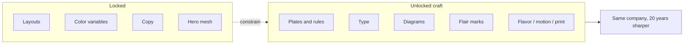
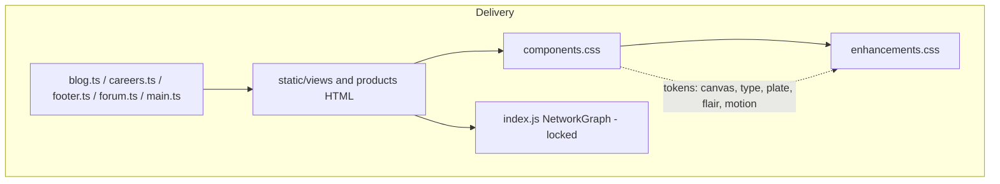
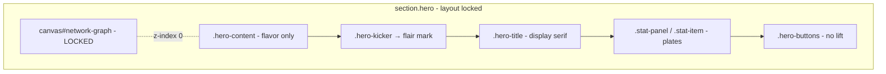
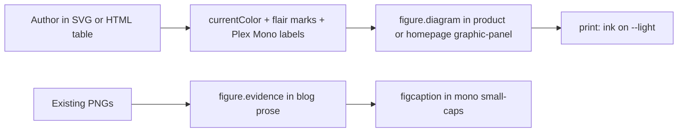
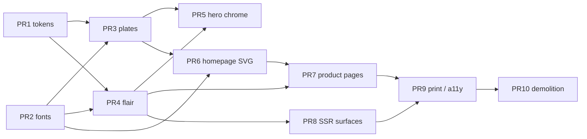

# Futureproofing the Visual Design of GatewayCorporate.org

| Field | Value |
| --- | --- |
| **Title** | Instrument Craft: A Visual Futureproofing Design for Gateway Corporate |
| **Author** | Gateway Design |
| **Date** | 2026-08-16 |
| **Status** | Draft |
| **Type** | Visual / frontend-craft design (complementary to `docs/design.md`) |
| **Audience** | Senior engineers and the person implementing CSS, type, diagrams, and tags |

---

## Overview

GatewayCorporate.org already has a distinctive product story — defense-adjacent signals intelligence, governed AI operations, and digital twins — delivered as server-rendered HTML with a shared CSS cascade and a locked hero mesh animation. The *surfaces* of that story have not kept pace with the seriousness of the copy. Cards are organic-radius glass plates. Tags are emoji pills. Type is the system-UI stack every 2024–2026 SaaS site ships. Product “infographics” are either NashTwin UI screenshots that will date on the next product release, or CSS bar charts that look like a dashboard widget kit. A second, unofficial palette of Tailwind sky/slate blues has drifted across `enhancements.css` and page-level `<style>` blocks, fighting the locked warm stone/bronze/slate tokens in `:root`.

This document specifies how to make the site look **twenty years more advanced than contemporary corporate sites** without changing locked layouts, locked color variables (except a deeper black canvas), locked copy, or the hero animation. The bet is not a 2026 trend. The bet is *instrument craft*: the visual language of a classified briefing plate, a swisstopo sheet, a JPL instrument panel, and a well-set letterpress page. Those things looked advanced in 1996, look advanced in 2026, and will look advanced in 2046 because they are about information, material, and type — not about fashion.

The work is five unlocked vectors: **borders and cards**, **fonts**, **product infographics**, **flair tags**, and **flavor**. Implementation stays inside the existing architecture (`components.css` → `enhancements.css` → page inline CSS; static HTML + TypeScript templates; no framework).

---

## Background & Motivation

### Current architectural frame (do not rewrite)

`docs/design.md` already locks the delivery model: server-rendered, indexable HTML; one shared runtime in `static/index.js`; consent-first telemetry; hero animation that paints immediately and idle-loads `/mesh.obj`. `docs/spec.md` enumerates routes. This document does not reopen those choices. Visual work must sit on that substrate.

The CSS contract is documented at the top of `static/enhancements.css`:

```
components.css (base) → enhancements.css (site enhancements) → inline CSS (page-specific)
```

Shared chrome is also emitted from TypeScript: `footer.ts` (`renderSiteFooter`), `blog.ts` / `careers.ts` page shells, `forum.ts` inline styles, and `main.ts` (`renderHomepageProductCard`, product-card injection). Any visual system that ignores those emitters will fork.

### What the site looks like today

**Tokens.** `:root` in `static/components.css` is a warm, mineral palette:

| Token | Value | Role |
| --- | --- | --- |
| `--primary` / `--dark` | `#1a1816` | Page ground |
| `--primary-light` | `#2a2520` | Raised surface |
| `--secondary` / `--secondary-light` | `#5a7a8c` / `#7a96a8` | Cool slate (the only cool note that is *owned*) |
| `--accent` | `#c9956f` | Bronze |
| `--success` / `--warning` | `#7cb342` / `#d4a574` | Status |
| `--light` / `--white` | `#f5ede1` / `#fefcf7` | Paper / highlight |
| `--gray-100` … `--gray-900` | `#35302a` → `#f5ede1` | Warm taupe scale |
| `--radius-sm` … `--radius-xl` | `11px` / `15px` / `21px` / `27px` | “Organic” radii |
| `--font-family` | `-apple-system, BlinkMacSystemFont, "Segoe UI", "Helvetica Neue", system-ui, sans-serif` | Entire site |
| `--font-family-serif` | `"Georgia", "Garamond", serif` | **Defined, never referenced** |
| `--transition` | `all 0.35s cubic-bezier(0.34, 1.56, 0.64, 1)` | Bounce / overshoot on almost everything |

Headings already declare `font-variation-settings: "wght" 700`, but no variable font is loaded, so those declarations are no-ops.

**Palette drift (the most important current defect).** The locked tokens are warm. The implemented chrome is not. `enhancements.css` re-skins `.card`, `.footer`, `.btn-secondary`, `.prose`, `.product-navbar`, and `.term-hint-popover` in Tailwind-slate/sky (`rgba(15, 23, 42)`, `#93c5fd`, `#7dd3fc`, `#94a3b8`, `#0f172a`). Homepage inline CSS in `static/views/index.html` goes further: `--hero-shell` is a cyan radial wash, `.founder-bio` and `.product-spotlight` use `rgba(37, 99, 235, …)` blue gradients, `.stat-panel` uses `#7dd3fc` borders. Product pages add `#60a5fa` / `#a78bfa` / `#34d399` step-card top-borders. Forum chips in `forum.ts` use `#1d4ed8`. The site currently reads as two companies: the token sheet says “bronze instrument,” the pixels say “2024 AI landing page.”

**Cards and borders.** `.card` in `components.css` is a 135° warm gradient plate with irregular radius `24px 28px 22px 26px`, a 1px cream hairline, `backdrop-filter: blur(10px)`, a sheen `::before`, and `translateY(-6px)` on hover. `enhancements.css` then overrides the same class to a cool-slate glass plate and a milder `translateY(-2px)`. Product pages (`static/products/{devicer,hyperlocal,nashtwin}.html`) re-override again with 16–24px radii and 2px white-alpha borders. Result: three card languages, all 2020s glass, none of them the locked mineral palette.

**Type.** No `@font-face`. No `static/fonts/`. No preload. The entire public site is system UI. `--font-family-serif` is dead code. Long-form (`.prose` in `enhancements.css`) is the same grotesque as the nav, at 1.05rem / 1.8, with sky-blue links (`#7dd3fc`) and 1rem-radius code blocks. This is the single largest reason the site looks like every other corporate site.

**Flair and chips (fragmented).** There is already a real classification system, then six lookalikes:

| Class | Where defined | Where used | Look |
| --- | --- | --- | --- |
| `.flair-tag` + `.flair-{intelligence,automation,governance,scoring,operations,security,integration,explainability}` | `components.css` ~2033–2184 | `views/{index,products,services,demos}.html`, `main.ts` product cards | Uppercase pill, emoji `::before` (`🔍⚙✦⭐👯✓🔗◎`), `scale(1.08)` hover |
| `.tag` | `components.css` ~426 | barely used | Smaller uppercase pill |
| `.badge` | `components.css` ~2258 | barely used | Pill with `•` prefix |
| `.post-tag` | `enhancements.css` ~770 | `blog.ts` `renderTags`, `careers.ts` `renderTags` | 999px slate chip, `#dbeafe` |
| `.job-meta-chip` / `.job-status` | `enhancements.css` ~601–638 | `careers.ts` `renderMetadataChips` | 999px slate/green chips |
| `.intent-chip` | product page `<style>` | product heroes | 999px sky pill, in-page jump links |
| `.paper-chip` / `.bundle-badge` / `.featured-badge` / `.plugin-badge` / `.step-badge` | product page `<style>` | product interiors | 999px colored pills |
| `.status-chip` | `views/contact.html` | contact form headline | 999px sky pill |
| `.board-chip` | `forum.ts` inline CSS | forum board nav | 999px, active = `#1d4ed8` |
| `.demo-card-chip` | `demos/devicer.html` | live demo | status chip |
| `.hero-kicker` / `.pill-row span` / `.eyebrow` | homepage + enhancements | heroes, product lists | 999px / tracked uppercase |

The *taxonomy* of flair is good. The *rendering* is consumer-SaaS.

**Infographics.** Five rasters live in `static/images/`:

| File | Size | Pixel size | Used in |
| --- | --- | --- | --- |
| `nash-optimization.png` | 148K | 698×888 | `content/blog/setting-up-nashtwin-for-your-business.md` |
| `pipeline-view.png` | 208K | 1116×903 | same |
| `plugin-marketplace.png` | 451K | 1115×738 | same |
| `saas-model.png` | 160K | 1121×756 | same |
| `twin-visualization.png` | 267K | 993×930 | same |

They are product-UI screenshots (rounded SaaS cards, empty `$0` pipeline, Inter-like UI chrome). They will look dated the moment NashTwin’s UI moves, and they already look like 2025 admin software, not like diagrams. Homepage product cards in `main.ts` draw CSS “infographics” (`.graphic-panel`, `.signal-stack`, `.benefit-bar`) — useful structure, generic rendering. Product pages themselves have **no** diagrams. The Devicer demo has a CSS `.pipeline` strip. There is no `static/diagrams/` directory and no SVG system.

**Flavor / motion.** `components.css` ships a “personality” kit that fights the brand: `.wiggle`, `.float-subtle`, `.btn-playful` (1° rotate), `.text-playful` (`✦` prefix), irregular blob radii on `.icon-circle` (`42% 58% 65% 35%`), bounce easing, `scale(1.08)` on every flair hover, `translateY(-6px)` on cards. Reduced-motion is handled (`components.css` ~2319, `enhancements.css` ~951, `index.js` NetworkGraph), but the *default* motion language is consumer-app, not instrument. There is **no `@media print` stylesheet** anywhere.

**Hero (locked).** Every marketing shell mounts `<canvas id="network-graph">` inside `<section class="hero">`. `static/index.js` `NetworkGraph` paints a plexus immediately and idle-loads `/mesh.obj` via `requestIdleCallback` (timeout 1500ms), with `prefers-reduced-motion` respected internally. Mesh node color is hardcoded `[205, 233, 255]`. This document does not change that class, that canvas, that mesh, or those colors. Flavor sits *around* it: `.hero-content`, `.hero-kicker`, `.stat-panel` / `.stat-item`, `.hero-buttons`, and the radial `--hero-shell` wash.

### Why this is a problem now

The copy is high-trust and technical. The chrome apologizes for it. A visitor comparing Gateway to a Palantir, Anduril, or Jane’s-quality briefing — or even to a well-set academic journal — sees Inter-era glass and emoji chips. That gap will widen as 2026 tropes (glass, AI gradients, Geist, 8px cards, pill soups) become the default look of *everyone else’s* leftover template. Futureproofing is the act of stepping off that conveyor.

---

## Goals & Non-Goals

### Goals

1. Specify a visual system that will still read as advanced in ~2046, by committing to craft that is older than the web and will outlive it: type, rules, diagrams, classification marks, material.
2. Execute only on the five unlocked vectors, mapped onto existing files, classes, and emitters.
3. Make the site look more like itself: same company, same pages, same words, same hero, same locked palette — with the unofficial sky/slate drift removed from *surfaces* (not from locked tokens, which stay).
4. Keep the architecture in `docs/design.md`: no framework, shared CSS, server-rendered HTML, deferred `index.js`, consent-first telemetry.
5. Stay inside performance, accessibility, reduced-motion, print, and SEO constraints of a static+SSR Deno site.
6. Produce an incremental PR plan in which each PR is independently reviewable.

### Non-goals

- Changing page layouts, grid structures, section order, or information architecture, except where a visual primitive can be *radically simplified* (unifying three card implementations; collapsing six chip APIs into one token set) without moving content.
- Changing color variables in `:root`, other than introducing a deeper canvas token and pointing `body` at it.
- Rewriting copy, headlines, CTAs, blog prose, or footer link labels.
- Touching `NetworkGraph`, `#network-graph`, `/mesh.obj`, mesh load timing, or mesh colors in `static/index.js`.
- Introducing a component framework, CSS-in-JS, Tailwind, or a design-token build step.
- Commissioning a custom typeface in v1 (allowed later; not required to hit the 2046 bar).
- Replacing blog operator-stills with generated “AI art,” or adding decorative 3D that competes with the hero.
- Redesigning the Devicer live demo’s *behavior* (its chrome may consume the new tokens).
- Changing experiment assignment, product-card *order*, or `{{PRODUCT_CARDS}}` injection logic.

### Locked vs unlocked (explicit)

| Locked | Unlocked |
| --- | --- |
| Layouts (grids, section sequence, card *placement*) | Card *surfaces*, borders, radii, shadows, hover |
| Color variables (`--primary`, `--secondary`, `--accent`, gray scale, etc.) | Hardcoded sky/slate rgba/hex that are *not* those variables |
| Background, except maybe more black | New `--canvas` token; `body { background }` |
| Already-written copy | Presentation of that copy (measure, figure style, small-caps, tabular nums) |
| Hero animation (`#network-graph`, mesh, idle-load) | Everything around the canvas: `.hero-content` plate, kicker, stats, buttons, `--hero-shell` wash |
| Spacing scale, navbar height tokens (layout) | Radius tokens, shadow tokens, transition tokens, new type tokens |
| Product/service/page existence | How diagrams, tags, and plates render on those pages |

---

## Visual Principles: What “20 Years More Advanced” Means

These are acceptance criteria, not mood.

### 1. Refuse 2026 tropes by name

Do **not** ship:

- Glassmorphism (`backdrop-filter` on cards, stat panels, buttons, product nav pills).
- Generic “AI” cyan/violet meshes and 135° blue gradients on marketing chrome (the *hero canvas* is exempt because it is locked).
- Inter, Geist, Satoshi, Plus Jakarta, Söhne-clones, or “the system UI stack as the brand.”
- 8px / 12px / 16px / 24px rounded-rect cards, or the current irregular “organic” radii (`24px 28px 22px 26px`).
- 999px pill soups.
- Emoji as taxonomy.
- Bounce/overshoot easing (`cubic-bezier(0.34, 1.56, 0.64, 1)`).
- Hover-lift as the primary affordance (`translateY(-6px)` / `scale(1.08)`).
- Screenshot-as-diagram.
- Gradient text on stat numbers (already in product `.stat-number`).

A reviewer should be able to open the site in 2036, squint, and *not* date it to “early generative-UI era.”

### 2. Commit to a material that predates the browser

The site’s material is **engraved plate on deep mineral ground**.

- Ground is near-black warm carbon, not navy and not Tailwind slate.
- Raised surfaces are the same mineral, one step lighter, with a hairline and an inset rule — the way a machined instrument bezel is two lines, not a drop shadow.
- Corners are square (1px radius only to kill subpixel shimmer). Craft lives in *corner ticks* (cartographic registration marks), not in fillet.
- Type sits *in* the plate, not on a frosted sheet of glass over a gradient.
- Bronze (`--accent`) and slate (`--secondary`) are inks and engravings, not glow.

This is why the look survives 20 years: it is closer to a 19th-century survey sheet and a 1970s instrument panel than to a 2025 Webflow template.

### 3. Typography is the product surface

A site that sets type at print quality will outlast every UI kit. We will load real faces with optical sizes, small-caps, old-style figures in prose, tabular lining figures in stats/tables, and a mono for classification. `--font-family-serif` stops being dead code.

### 4. Diagrams are drawn, not captured

Infographics are authored SVG (and HTML tables) in the site’s own marks. Product screenshots become *evidence stills*, captioned and framed, never the explanation itself.

### 5. Classification, not decoration

Tags are registry marks. They identify a topic the way a map identifies a series. They do not jiggle.

### 6. Density without clutter

Do not add copy. Do add alignment, hanging punctuation, caption hierarchy, and tabular numbers so the *same words* carry more. Information density is a craft property, not a content property.

### 7. Motion is mechanical

Non-hero motion has mass and no spring. If it would look wrong on a plotter, it is wrong here.

### 8. The site must still be Gateway

Warm mineral tokens stay. Bronze stays. The wordmark stays. The mesh stays. The sentences stay. A returning visitor should think “they finally built the chrome the copy deserved,” not “they rebranded.”



---

## Proposed Design

### 0. Cascade and ownership

Keep the three-layer cascade. Change *what each layer is allowed to do*.

| Layer | File / emitter | Owns | Must stop doing |
| --- | --- | --- | --- |
| Tokens + primitives | `static/components.css` | `:root` craft tokens, type faces, `.card` plate, `.flair-tag` marks, `.btn` geometry, forms, a11y, print | Organic radii, bounce `--transition`, emoji flair, glass `backdrop-filter` on plates |
| Site chrome | `static/enhancements.css` | Nav, footer, product-nav, prose, blog/careers chips *as consumers* of primitives, term-hint, scroll-progress | Re-skinning `.card` into cool-slate glass; sky-blue prose links; 999px chips with unique recipes |
| Page inline | `static/views/*.html`, `static/products/*.html` | Page-specific *layout* and page-specific chrome only (already locked) | Local `border-radius`, `backdrop-filter`, sky-blue borders, pill chips; homepage hero/product-card tuning that is not part of the shared primitive |
| SSR emitters | `blog.ts`, `careers.ts`, `footer.ts`, `forum.ts`, `main.ts` | Markup shape, `class` names | Hardcoded chip recipes in inline `<style>` (forum); new wrapper classes only when needed |

This is intentionally a multi-file cleanup: homepage styling in `static/views/index.html` and product-level overrides in `static/products/*.html` are part of the current implementation and need to be normalized in the same review pass rather than treated as isolated exceptions.

**Radical simplification (allowed under the layout lock):** merge the duplicate `.navbar` logic in `components.css` (defined twice at ~1210 and ~1274) into a single shared primitive, preserving the scroll/slide behavior and mobile menu interactions while removing redundant style fragments; delete the `enhancements.css` `.card` override (~1017–1078) once the primitive is correct; and remove product-page card/chip `<style>` that only exists to fight the primitive. This is a cleanup pass, not a de-feature of mobile nav or scroll states. Page grids (`.product-offerings-row`, `.problem-grid`, `.grid-3`) stay.



### 1. Flavor, operationally

Flavor is not a vibe pass. It is a closed list of micro-decisions.

#### 1.1 Material language

- **Canvas:** new token `--canvas: #0c0b0a` (warm, deeper than `--primary: #1a1816`). `body { background-color: var(--canvas); }`. `--primary` remains the *raised plate* fill. This is the single allowed color-ground change.
- **Plate:** fill `--primary` or `color-mix(in oklab, var(--primary-light) 88%, var(--canvas))`. No 135° gradient fills on cards, footers, or founder/product spotlights.
- **Rule:** 1px `color-mix(in oklab, var(--gray-400) 70%, transparent)` outer; 1px inset rule at `color-mix(in oklab, var(--gray-200) 80%, transparent)`. Two lines = instrument bezel.
- **Tick:** 7×7px corner marks drawn with `background` conic/linear tricks or a 4-corner `::after` mask. Ticks use `--secondary` at 0.55 alpha. No rounded clip.
- **Sheen:** forbidden. Delete `.card::before` gradient veils and `.projects-highlight::before` sweep.
- **Blur:** `backdrop-filter` is removed from `.card`, `.btn-secondary`, `.form-input`, `.hero .stat-item`, `.stat-panel`, `.icon-circle`, `.product-nav-link`. It may remain on `.navbar` and `.dropdown-menu` at ≤12px because those sit *over* the locked hero canvas and must keep type readable; even there, prefer a near-opaque `--primary` at 0.94 over frost.

#### 1.2 Typographic texture

Covered in §3. Flavor-level rules that apply regardless of face:

- Headings: `text-wrap: balance`; measure ≤ 28ch on `.hero-title`, ≤ 36ch on `.heading-2` / `.section-title`.
- Prose: `text-wrap: pretty`; hanging punctuation (`hanging-punctuation: first last` where supported).
- Eyebrows, kickers, stat labels, table headers, flair: `font-variant-caps: all-small-caps; letter-spacing: 0.14em;` — replace `text-transform: uppercase` on `.eyebrow`, `.microcopy`, `.stat-label`, `.graphic-title`, `.proof-label`, `.product-nav-label`.
- Figures in running text (`.prose`): `font-variant-numeric: oldstyle-nums proportional-nums`.
- Stats, tables, prices, `.stat-value`, `.stat-number`, comparison tables: `font-variant-numeric: tabular-nums lining-nums`.
- Kill `.text-gradient` on marketing chrome. Keep `--accent` as a *spot* color, not a fill.

#### 1.3 Motion of non-hero elements

Replace the global bounce.

```css
:root {
  --ease-out: cubic-bezier(0.2, 0, 0, 1);      /* mechanical */
  --ease-in-out: cubic-bezier(0.4, 0, 0.2, 1);
  --duration-fast: 160ms;
  --duration: 280ms;
  --transition: color var(--duration) var(--ease-out),
                border-color var(--duration) var(--ease-out),
                background-color var(--duration) var(--ease-out),
                box-shadow var(--duration) var(--ease-out);
}
```

Do **not** use `transition: all`. Do **not** translate or scale on hover for plates, tags, or buttons. Hover language:

| Element | Hover |
| --- | --- |
| Plate / card | Outer rule brightens to `--secondary`; ticks go to `--accent` |
| Button | Fill mixes 8% toward `--secondary-light`; no lift |
| Flair | Mark cell inverts (bronze field, canvas letters) |
| Footer link | Existing underline-grow is fine; keep it, drop color-to-sky |
| Nav link | Hairline underline, no pill fill |

Delete or neutralize (zero-duration under the existing reduced-motion query, then remove from markup usage): `.wiggle`, `.float-subtle`, `.btn-playful`, `.personality-box`, `.cta-pulse`, `.lift-on-hover`, flair `transform: scale(1.08)`, card `translateY(-6px)`, `.icon-circle` morphing border-radius, `slideDownNavbar` if it fights first-paint. Keep `.scroll-progress` (it is a reading instrument). Restyle `.nav-indicator` from a pulsing slate gradient to a 1px `--accent` scanline at 0.35 opacity, no `indicatorPulse`.

Hero `::before` / `::after` glow animations in `enhancements.css` (`heroGlow`) are *around* the canvas, not the canvas. Recolor them from `rgba(71, 85, 105, …)` to `color-mix(in oklab, var(--secondary) 18%, transparent)` and drop the 1.1 scale. Do not remove them in the first PR if the canvas read suffers; they are flavor, not the locked animation.

#### 1.4 Print-quality craft

Add `@media print` in `components.css` (primitives) with a small override hook in `enhancements.css`:

- Force `--canvas` / `body` to `--light` (`#f5ede1`); type to `--dark`.
- Plates lose box-shadow; rules become `0.25pt` solid `#1a1816`.
- Nav, menu, scroll-progress, canvas, dropdown, forms’ captcha: `display: none`.
- Diagrams: `filter: none`; SVG uses `currentColor` so they invert with the type.
- Flair marks print as `[SI] Device Fingerprinting` via `::before` still working in print.
- Widows/orphans: `p, li { orphans: 3; widows: 3; }`; `h1, h2, h3 { break-after: avoid; }`.
- `@page { margin: 18mm; }`.

A printed FAQ or blog post should look like a briefing annex, not like a screenshot of a website.

#### 1.5 Hero coexistence (without touching the animation)



Rules:

- Do not change `#network-graph` CSS beyond what already exists (`position: absolute; inset 0; pointer-events: none; z-index: 0`).
- Do not change `NetworkGraph` in `index.js`.
- `.hero-content` currently (`enhancements.css` ~378–391) is a frosted 16px card with a sky-slate border and a 180° navy veil. Replace with either:
  - **Preferred:** no box. Type sits directly on the mesh with a stronger text-shadow already present (`0 2px 14px rgba(2, 6, 23, 0.92)`). This is the radical simplification: remove the glass plate so the locked animation is the stage.
  - **Fallback if contrast fails WCAG on the mesh after browser review:** a full-bleed transparent plate with the instrument double-rule and no fill above 0.22 alpha of `--canvas`, radius 1px, no blur. The fallback must be tested in the real browser, not assumed from design mockups.
- `--hero-shell` in `views/index.html` (cyan radials + `#0f172a` gradient) is not a locked color variable. Recolor to warm carbon: `radial-gradient(circle at 12% 10%, color-mix(in oklab, var(--secondary) 16%, transparent), transparent 42%)` over `--canvas`. This keeps depth without the “AI blue” read.
- `.hero-kicker` becomes a `.flair-tag` (or consumes the same tokens). Text stays “Intelligence Systems and Strategic AI”.
- `.stat-panel` (homepage) and `.hero .stat-item` / product `.stat-item` become instrument plates. `.stat-value` uses tabular lining, display or UI sans — not gradient-fill text.
- Product `.product-navbar` pills (999px, sky hover) become flair-shaped marks. This is chrome around product heroes, not the animation.

### 2. Borders and card styles

#### 2.1 New craft tokens (add to `:root`; do not edit locked color values)

```css
:root {
  /* Ground exception — new token, --primary unchanged */
  --canvas: #0c0b0a;

  /* Rules */
  --rule-color: color-mix(in oklab, var(--gray-400) 70%, transparent);
  --rule-color-strong: color-mix(in oklab, var(--secondary) 75%, var(--gray-400));
  --rule-color-accent: color-mix(in oklab, var(--accent) 80%, transparent);
  --rule: 1px solid var(--rule-color);
  --rule-strong: 1px solid var(--rule-color-strong);
  --rule-inset: 1px solid color-mix(in oklab, var(--gray-200) 80%, transparent);

  /* Geometry — replace organic radii in use, leave old tokens unused until deleted */
  --radius-plate: 1px;
  --radius-control: 2px;
  --radius-mark: 0px;
  --tick-size: 7px;
  --inset-gap: 3px;

  /* Surfaces */
  --surface: var(--primary);
  --surface-raised: color-mix(in oklab, var(--primary-light) 88%, var(--canvas));
  --shadow-plate: none; /* plates do not float */

  /* Motion: see §1.3 */
}
```

`--radius-sm` … `--radius-xl` stay in the file through PR 1 so we do not break pages, then stop being referenced, then are deleted in the cleanup PR. That is a token retirement, not a color change.

#### 2.2 The plate primitive

Replace `.card` (both definitions) with one primitive. Structural flex/grid behavior of `.card` / `.card-header` / `.card-body` / `.card-footer` / `.card-centered` / `.card-grid` **stays** (layout lock).

```css
.card {
  --_rule: var(--rule-color);
  position: relative;
  display: flex;
  flex-direction: column;
  height: 100%;
  padding: var(--spacing-xl) var(--spacing-lg);
  background: var(--surface-raised);
  color: var(--gray-700);
  border: var(--rule);
  border-radius: var(--radius-plate);
  box-shadow: var(--shadow-plate);
  overflow: visible; /* ticks sit on the corner, not clipped */
}

.card::before {
  /* inset rule */
  content: "";
  position: absolute;
  inset: var(--inset-gap);
  border: var(--rule-inset);
  border-radius: inherit;
  pointer-events: none;
}

.card::after {
  /* four corner ticks via a mask; implementation can also be 4 box-shadows */
  content: "";
  position: absolute;
  inset: -1px;
  pointer-events: none;
  background:
    linear-gradient(var(--_rule), var(--_rule)) 0 0 / var(--tick-size) 1px no-repeat,
    linear-gradient(var(--_rule), var(--_rule)) 0 0 / 1px var(--tick-size) no-repeat,
    linear-gradient(var(--_rule), var(--_rule)) 100% 0 / var(--tick-size) 1px no-repeat,
    linear-gradient(var(--_rule), var(--_rule)) 100% 0 / 1px var(--tick-size) no-repeat,
    linear-gradient(var(--_rule), var(--_rule)) 0 100% / var(--tick-size) 1px no-repeat,
    linear-gradient(var(--_rule), var(--_rule)) 0 100% / 1px var(--tick-size) no-repeat,
    linear-gradient(var(--_rule), var(--_rule)) 100% 100% / var(--tick-size) 1px no-repeat,
    linear-gradient(var(--_rule), var(--_rule)) 100% 100% / 1px var(--tick-size) no-repeat;
}

.card:hover {
  --_rule: var(--rule-color-strong);
  border-color: var(--rule-color-strong);
  transform: none;
}

.card-primary { --_rule: var(--rule-color-strong); }
.card-accent  { --_rule: var(--rule-color-accent); }

.card-title::after { /* 40px gradient underline → 2em hairline */
  width: 2em;
  height: 1px;
  background: var(--secondary);
  opacity: 0.7;
  border-radius: 0;
}
```

Variants mapped from current classes:

| Current | New treatment |
| --- | --- |
| `.card` | Plate |
| `.card-primary` | Plate + stronger rule (delete 3px top gradient `::after`) |
| `.card-accent` | Plate + bronze ticks |
| `.product-spotlight`, `.offering-card`, `.path-card`, `.service-track`, `.step-card` (homepage), `.evaluation-card`, `.founder-bio`, `.fit-card`, `.paper-card`, `.pricing-card`, `.contact-panel`, `.book-panel`, `.form-container`, `.testimonial`, `.callout`, `.projects-highlight` | Become plates by sharing the primitive (add `card` where missing, or a `.plate` mixin class). **Do not change their grid placement.** |
| `.pricing-card.featured` | Bronze outer rule + `featured-badge` as a flair mark. No scale, no 8px lift. |
| `.comparison-table-wrap` | Radius 1px; delete 20px rounding. Table itself is the diagram. |

Product-page colored *top borders* on `.step-card.route` / `.feature-card.routes` (`#60a5fa` etc.) are 2026 rainbow-SaaS. Replace with the existing flair taxonomy: a `.flair-tag` in the header and a 1px `--secondary` or `--accent` outer rule. Colors stay inside the locked palette.

`.icon-circle` loses the blob morph. It becomes a 1px-radius plate, 72–100px, with the existing emoji *temporarily* allowed (those emoji are in markup in `main.ts` and `views/products.html`: 🔍 💬 ♟️). A later cleanup can replace emoji icons with SVG marks; that is not v1 because it touches markup that sits next to locked copy. Do not animate them.

#### 2.3 Buttons, inputs, nav (same geometry language)

- `.btn` radius → `--radius-control`. Delete `18px 24px 20px 22px` and the size-specific organic radii.
- `.btn-primary` may keep a *flat* `--secondary` fill (not a 135° gradient). `.btn-warm` stays `--accent` flat.
- `.btn-secondary` / `.btn-outline` / `.btn-minimal`: transparent plate, `--rule`, no blur.
- Delete hover `translateY` / `scale` / `rotate` on all `.btn*` (including product-page local `.btn:hover`).
- `.btn-arrow::after` slide is acceptable (1-axis, no bounce); retune to `--ease-out`.
- Inputs: `--radius-control`, `--rule`, no blur; focus = `--rule-strong` + 3px `color-mix(in oklab, var(--secondary) 28%, transparent)` ring. Keep the existing `:focus-visible` 2.5px outline; square it (`border-radius: 0` on the outline).
- `.navbar`: near-opaque `--canvas` at 0.94, 1px `--rule` bottom, no 32px shadow theater. `.navbar.scrolled` only increases opacity to 0.98.
- `.footer`: `--surface` fill, 1px top rule, no 135° slate gradient. `footer.ts` markup is already clean (`.footer`, `.footer-link`, `.heading-4`); CSS-only.

**Contrast targets.** Hairlines on `--canvas` must meet WCAG 2.2 non-text contrast 3:1. `--gray-400` (`#5a5047`) on `#0c0b0a` is ~3.3:1 — acceptable for rules. Body text stays `--gray-700` (`#c9bfb0`) on canvas, which is ~9:1. Do not lighten rules below `--gray-400`.

### 3. Fonts

#### 3.1 Choice and why it will still look advanced in 2046

| Role | Face | License | Why |
| --- | --- | --- | --- |
| Display + text serif | **Source Serif 4** (variable, `opsz` + `wght`) | OFL, Adobe | Optical sizes are how books have worked for 500 years. A 72pt heading and a 17px journal paragraph are *different drawings*. This is the opposite of Inter-at-every-size. |
| UI grotesque | **IBM Plex Sans** (variable `wght`) | OFL, IBM | Designed as institutional infrastructure type, not as a 2022 startup identity. Will read as “civil service / lab / vendor to government” in 2046, which is correct. |
| Classification / figures / diagrams | **IBM Plex Mono** (static, 400/500) | OFL, IBM | Real italics, tabular figures, a voice that says “record,” not “code block from a Tailwind kit.” |

Rejected faces (and why):

- Inter / Geist / Satoshi / Plus Jakarta — the 2022–2026 default. Will date as “early LLM-era SaaS.”
- System UI stack — what we have now; invisible as craft.
- Georgia/Garamond system serif — better than nothing, but no optical size, no small-caps, inconsistent across platforms. Keep only as the *fallback* for `--font-display`.
- IBM Plex Serif instead of Source Serif 4 — good, but weaker optical-size story.
- A commissioned custom face — correct long-term, out of scope for v1.
- Computer Modern / STIX — too “LaTeX paper”; we are a corporation, not an arXiv HTML port.

`--font-family-serif` is re-pointed at the new display stack. `--font-family` becomes the UI stack. Headings switch to display.

```css
:root {
  --font-ui: "IBM Plex Sans", "Segoe UI", system-ui, sans-serif;
  --font-display: "Source Serif 4", "Iowan Old Style", Georgia, "Times New Roman", serif;
  --font-text: var(--font-display);
  --font-mono: "IBM Plex Mono", "ui-monospace", "Cascadia Mono", "Segoe UI Mono", monospace;
  --font-label: var(--font-ui);

  --font-family: var(--font-ui);          /* keep name; existing consumers keep working */
  --font-family-serif: var(--font-display);
}
```

Assignment:

| Surface | Face | Notes |
| --- | --- | --- |
| `body`, nav, buttons, forms, footer, chips | `--font-ui` | 400/500/600 only |
| `.heading-1`, `.heading-2`, `.hero-title`, `.section-title`, `.founder-name`, `.card-title` | `--font-display` at `opsz` 48–72 | weight 600; tracking `-0.018em` |
| `.heading-3`, `.heading-4` | `--font-display` at `opsz` 24–36 | weight 600 |
| `.prose` (blog, jobs) | `--font-text` at `opsz` 14–18 | 400/600; 1.05–1.125rem; measure 62–68ch |
| `.flair-tag`, `.eyebrow`, `.microcopy`, `.stat-label`, table headers, `.graphic-title` | `--font-label` small-caps | or `--font-mono` for the mark cell |
| `.stat-value`, prices, comparison cells, diagram numerals | `--font-mono` or UI with tabular nums | lining |
| `code`, `pre`, forum post numbers | `--font-mono` | already Courier in forum/demo; replace |

#### 3.2 Loading strategy (same-origin, no render-blocking webfont party)

1. Self-host subset WOFF2 in `static/fonts/`:
   - `source-serif-4-opsz-latin.woff2` (variable)
   - `ibm-plex-sans-latin.woff2` (variable)
   - `ibm-plex-mono-400-latin.woff2`, `ibm-plex-mono-500-latin.woff2`
2. `@font-face` in `components.css` (so every shell inherits it — blog/careers/forum already link that file):

```css
@font-face {
  font-family: "Source Serif 4";
  src: url("/fonts/source-serif-4-opsz-latin.woff2") format("woff2");
  font-style: normal;
  font-weight: 400 700;
  font-display: swap;          /* headings may swap; they are the craft */
  unicode-range: U+0000-00FF, U+0131, U+0152-0153, U+02BB-02BC, U+02C6, U+02DA, U+02DC, U+2000-206F;
}
@font-face {
  font-family: "IBM Plex Sans";
  src: url("/fonts/ibm-plex-sans-latin.woff2") format("woff2");
  font-style: normal;
  font-weight: 400 600;
  font-display: optional;      /* chrome never FOUTs; fallback is system-ui */
  size-adjust: 100%;
  unicode-range: U+0000-00FF, U+0131, U+0152-0153, U+02BB-02BC, U+02C6, U+02DA, U+02DC, U+2000-206F;
}
```

3. Preload **one** file on marketing shells (index, products, services, product pages): the Source Serif 4 variable. Do not preload Plex Sans (`optional` means it applies only if cached in time). Blog/careers article shells preload Source Serif 4 because prose *is* the page.
4. Add `<link rel="preload" as="font" type="font/woff2" crossorigin href="/fonts/source-serif-4-opsz-latin.woff2">` to:
   - `static/views/*.html` heads
   - `static/products/*.html` heads
   - `blog.ts` `renderPageShell`
   - `careers.ts` equivalent shell
   - `forum.ts` shell
5. `main.ts` static-file server already caches static assets long-term in production (`docs/spec.md` §11). Fonts fall under “static binary/text assets: 1 year immutable.” Fingerprint filenames if we ever change files (`source-serif-4-opsz-latin.v1.woff2`).
6. Budget: ≤ 80 KB compressed critical (serif variable), ≤ 180 KB full stack. Measure with a locally-subsetted build (`pyftsubset` / `glyphhanger` against the actual HTML corpus). If Plex Sans variable exceeds ~45 KB, ship 400 and 600 static instead.
7. Fallback metrics: tune `size-adjust`, `ascent-override`, `descent-override` so system-ui → Plex and Georgia → Source Serif do not shift layout (CLS < 0.01 on headings).
8. CSP: fonts are same-origin; no new `font-src` hosts. Confirm `libs/security.ts` CSP allows `font-src 'self'` (add if missing — this is a security-header change, not a visual one).
9. `font-variation-settings: "wght" 700` on headings becomes `"opsz" 72, "wght" 600` for display and `"opsz" 18, "wght" 400` for prose. Those declarations finally do something.

No Google Fonts. No `fonts.gstatic.com`. No runtime JS font loader.

### 4. Product infographics

#### 4.1 Thesis

A screenshot of a product is a *receipt*. A diagram is an *argument*. Gateway currently publishes receipts (`static/images/*.png`) and dashboard widgets (`.benefit-bar`). The futureproof move is to author arguments in SVG that use the same rules, type, and marks as the rest of the site, so a diagram made in 2026 still looks like Gateway in 2046 even if NashTwin’s UI is unrecognizable.

#### 4.2 Three kinds of figure

| Kind | Medium | When | Examples |
| --- | --- | --- | --- |
| **System map** | Hand-authored inline or `static/diagrams/*.svg` | Explaining a pipeline, twin, or runtime | Devicer signal path; HyperLocal route → act → fall back; NashTwin map → simulate → optimize |
| **Decision matrix** | Semantic HTML `<table>` (`.comparison-table` already exists) | Pricing, feature compare, plugin list | Existing comparison tables on product pages; homepage is *not* a new table (layout lock) |
| **Operator still** | Existing PNG, reframed | “This is what the operator sees” | The five NashTwin screenshots in the journal |



#### 4.3 Production rules for SVG

- Directory: `static/diagrams/`.
- Filenames: `devicer-signal-path.svg`, `hyperlocal-runtime.svg`, `nashtwin-loop.svg`, plus any homepage extracts (`devicer-layers.svg`, etc.).
- ViewBox-only, no hardcoded pixel widths. `width="100%"`, `role="img"`, `<title>` + `<desc>`.
- Stroke: 1px at the viewBox scale; `vector-effect: non-scaling-stroke` on rules.
- Color: `currentColor` for ink; CSS variables for accent (`stroke="var(--accent)"` works in inline SVG). **No** `#60a5fa`.
- Type inside SVG: `font-family="var(--font-mono)"` for labels, `var(--font-display)` for the figure title if the title lives in the SVG (prefer HTML `<figcaption>` so it is indexable and selectable).
- No drop shadows, no rounded-rect nodes > 2px, no 3D isometric “AI platform” clichés, no illustrations of smiling operators.
- Motion: CSS only, on `stroke-dashoffset` or opacity, ≥ 800ms, `--ease-out`, paused under `prefers-reduced-motion`. No SMIL loops. No JS chart library (keeps `docs/design.md` “no framework / low main-thread” intact).
- File budget: ≤ 20 KB gzip per diagram. If a drawing exceeds that, it is too pictorial.

#### 4.4 Where diagrams go (without changing layouts)

**Homepage product cards** (`main.ts` `renderHomepageProductCard`): replace the inner `.graphic-panel` pair with one inline SVG each, keeping the `.product-graphic` grid slot (layout lock). The `.signal-stack` / `.benefit-bar` *content* is recast as labeled nodes in the SVG so no meaning is lost. Visible words stay the same (“Device”, “TLS”, “IP + ASN”, “Peer Graph”, etc. — those strings are copy-adjacent; keep them verbatim).

**Product pages:** each page gets **one** system map, inserted into an existing section without adding a new top-level section if it would count as a layout change. Preferred slots (empty of diagrams today):

- Devicer: inside `#suite` or immediately after the plugin cards — a left-to-right signal path: Request → Core → Plugins → Score.
- HyperLocal: inside `#runtime` / solution steps — Route → Ground → Act / Fail.
- NashTwin: inside `#twin` — Map → Simulate → Optimize, feeding a scored move.

If inserting a figure would force a new grid row that reflows the locked sections, place the SVG *inside* the existing section header’s visual field as a full-width figure above the existing card grid. Section sequence does not change.

**Journal:** do not delete the five PNGs. Wrap rendered markdown images in a figure. `blog.ts` `sanitizeRenderedHtml` already allows `img` and `span`. Extend `allowedTags` with `figure` and `figcaption`, and add a transform that wraps standalone `` in:

```html
<figure class="evidence">
  
  <figcaption><!-- existing alt text --></figcaption>
</figure>
```

`.prose img` currently (`enhancements.css` ~890) is a 1rem-radius sky-bordered screenshot. Restyle `.evidence` as a plate: 1px rule, 1px radius, caption in `--font-mono` small-caps underneath. Alt text already exists in the markdown; it becomes the caption. No copy rewrite.

**Demo:** `static/demos/devicer.html` `.pipeline` can consume the same diagram tokens. Do not change its step labels.

#### 4.5 What we explicitly will not do

- Regenerating PNGs from Figma every release as the *explanation*.
- Client-side chart SDKs (Chart.js, D3 as a runtime).
- Animated “particle pipeline” decorations that compete with `#network-graph`.
- Photographing the product and applying glass or mock-OS chrome.

### 5. Flair tags

#### 5.1 Conceptual promotion

Flair is a **classification registry**, not a chip kit. The existing eight topic modifiers are the registry. Everything else is a consumer.

#### 5.2 Mark table (CSS-only — no copy changes)

`::before` currently injects emoji. Replace the content. Markup text stays.

| Class | Mark | Meaning | Color (locked tokens only) |
| --- | --- | --- | --- |
| `.flair-intelligence` | `SI` | Signals / identity | `--secondary` |
| `.flair-automation` | `AO` | Automation / AI ops | `--success` |
| `.flair-governance` | `GV` | Governance / policy | `--accent` |
| `.flair-scoring` | `SC` | Scoring / decision | `--accent` |
| `.flair-operations` | `OP` | Operations / twins | `--warning` |
| `.flair-security` | `SE` | Security / risk | `--accent` |
| `.flair-integration` | `IN` | Integration | `--secondary` |
| `.flair-explainability` | `EX` | Explainability | `--success` |
| `.flair-tag` (no modifier) | `◆` remains as a geometric tick, not an emoji | Generic | `--secondary` |

#### 5.3 Primitive

```css
.flair-tag {
  display: inline-flex;
  align-items: center;
  gap: 0;
  padding: 0;
  background: transparent;
  border: var(--rule);
  border-radius: var(--radius-mark);
  color: var(--secondary);
  font-family: var(--font-label);
  font-size: 0.72rem;
  font-weight: 500;
  font-variant-caps: all-small-caps;
  letter-spacing: 0.14em;
  line-height: 1;
  cursor: default;
  transform: none;
}
.flair-tag::before {
  content: "◆";
  display: inline-flex;
  align-items: center;
  justify-content: center;
  min-width: 1.9em;
  padding: 0.28em 0.35em;
  margin-right: 0;
  border-right: var(--rule);
  font-family: var(--font-mono);
  font-variant-caps: normal;
  font-weight: 500;
  letter-spacing: 0.04em;
  font-size: 0.68rem;
}
.flair-tag > * , .flair-tag {
  /* label padding on the host */
  padding-right: 0.55em;
}
.flair-intelligence::before { content: "SI"; }
/* … */
.flair-tag:hover {
  transform: none;
  background: transparent;
  border-color: var(--rule-color-strong);
}
.flair-tag:hover::before {
  background: var(--accent);
  color: var(--canvas);
  border-right-color: var(--rule-color-strong);
}
```

The label padding is applied on the host so existing markup (`<span class="flair-tag flair-intelligence">Device Fingerprinting</span>`) needs **zero** HTML edits to look correct.

Optional progressive enhancement, not required for v1: `data-mark="SI"` with `content: attr(data-mark)` so SSR emitters can be explicit. CSS `::before` content is enough.

#### 5.4 Unification map (consumers, not new brands)

| Current class | Action |
| --- | --- |
| `.flair-tag` + modifiers | Primitive. Keep class names forever. |
| `.tag`, `.badge` | Restyle as aliases of `.flair-tag` (same geometry). Deprecate in cleanup. |
| `.post-tag` | Same geometry; no mark cell (or mark `JN` for journal). Emitted by `blog.ts` `renderTags`. CSS-only. |
| `.job-meta-chip` | Same geometry; no mark, or mark `HR`. `careers.ts` unchanged. |
| `.job-status.is-open` / `.is-closed` | Same geometry; mark `ON` / `CL`; colors `--success` / `--gray-500`. |
| `.intent-chip` | Visually a flair; remains an `<a>`. Product-page CSS deleted in favor of `.flair-tag` plus `a.intent-chip`. |
| `.paper-chip`, `.bundle-badge`, `.featured-badge`, `.plugin-badge`, `.step-badge` | Same geometry. Plugin open/premium = `--secondary` / `--accent` mark cell (`OS` / `PR`). Step badges keep “Step 1” copy; mark is `01`/`02`/`03`. |
| `.status-chip` | Contact headline. Same geometry, mark `SL` (SLA) or no mark. |
| `.board-chip` | Forum. Same geometry. `.is-active` = inverted mark cell, **not** `#1d4ed8`. |
| `.demo-card-chip` | Demo status. Same geometry. |
| `.hero-kicker`, `.eyebrow`, `.pill-row span` | Consume label typography; kicker may *be* a flair. |

`a.intent-chip` and `a.board-chip` are interactive; they get `:focus-visible` squares and a hover identical to flair hover. They do not scale.

#### 5.5 Component API (for new markup only)

```html
<!-- Existing, preferred: CSS supplies the mark -->
<span class="flair-tag flair-intelligence">Device Fingerprinting</span>

<!-- Link consumer -->
<a class="flair-tag flair-operations intent-chip" href="#twin">Simulation Workflow</a>

<!-- Emitted tags without a topic modifier -->
<span class="post-tag">fingerprinting</span>
```

Do not introduce a web component. Do not introduce a JS helper. Server-rendered spans are the API.

---

## API / Interface Changes

No public HTTP API changes. Frontend contracts:

| Contract | Before | After |
| --- | --- | --- |
| CSS entry | `components.css` + `enhancements.css` | Same hrefs, plus `/fonts/*.woff2` |
| Card class API | `.card`, `.card-primary`, `.card-accent`, plus a dozen page-local skins | Same classes; skins deleted or aliased |
| Flair class API | `.flair-tag.flair-*` | Unchanged class names; new look |
| Blog sanitize | `allowedTags` includes `img`, `span` | Also `figure`, `figcaption` |
| Font loading | none | `@font-face` + one preload per shell |
| Hero JS | `NetworkGraph` | Unchanged |
| CSP | `font-src` possibly unspecified | `'self'` for fonts |
| Footer | `renderSiteFooter()` markup | Unchanged |

`sanitize-html` in `blog.ts` / `careers.ts` must allow `figure`/`figcaption` and the output must wrap standalone `` blocks in an evidence figure with a caption derived from the existing `alt` text. That is the only TypeScript interface change that is load-bearing. The tags themselves are not enough; the transform is what preserves the journal stills as evidence rather than stripping them to bare images.

---

## Implementation Roadmap

This is the delivery sequence that keeps the work reviewable and avoids mixing architecture, type, and content changes in one giant pass.

### PR 1 — Foundation: canvas, rules, cards, motion

Scope:

- Add `--canvas` and align `body` background to the warm carbon ground.
- Replace the glass card override in `enhancements.css` with the plate primitive defined in §2.
- Remove the 135°/cyan glass treatment from `.card`, `.btn-secondary`, `.product-nav-link`, `.hero-content`, `.stat-panel`, and `.form-input` consumers.
- Retire the bounce timing and hover-lift rules by updating the transition tokens and suppressing `translateY` / `scale` on interactive surfaces.
- Add print defaults in `components.css`.

Exit criteria:

- The site reads as a single warm mineral palette, even when the hero mesh remains blue.
- No surface uses a sky-blue glass treatment or a 2025 AI gradient.
- `body` background is warm black, not Tailwind slate or navy.

### PR 2 — Typography as the product surface

Scope:

- Add the self-hosted font files and `@font-face` declarations in `components.css`.
- Reassign `--font-family` and `--font-family-serif` to the new UI and display stacks.
- Update headings, hero title, `.prose`, labels, stat values, and tables to use display serif, UI sans, and mono presence correctly.
- Preload the serif variable font on the relevant page shells and verify no layout shift is introduced.

Exit criteria:

- Long-form prose looks editorial and calm, not like SaaS boilerplate.
- Headings have optical character weight and rhythm rather than a generic system default.
- Type settles into a hierarchy that reads as “briefing plate” rather than “dashboard kit.”

### PR 3 — Tags, product nav, and classification marks

Scope:

- Replace emoji-based flair with the mark-cell system in §5.
- Re-style `.flair-tag`, `.post-tag`, `.job-meta-chip`, `.board-chip`, `.status-chip`, and related plumbing to share a common geometry and mark language.
- Convert product nav pills, hero kickers, and status chips from 999px SaaS pills to the same instrument registry pattern.
- Keep class names stable so the markup and emitters do not need a broad rewrite.

Exit criteria:

- The site uses a single visual language for classification and navigation labels.
- The same mark language appears across homepage, product, journal, forum, and careers pages.
- No interface element reads as a rainbow pill soup.

### PR 4 — Diagrams, evidence, and SVG system

Scope:

- Create `static/diagrams/` and author the first system maps for Devicer, HyperLocal, and NashTwin.
- Replace homepage “benefit bar” / `.signal-stack` visual placeholders with SVGs that still carry the same meaning and labels.
- Extend the blog sanitize allowlist to admit `figure` and `figcaption` and wrap image blocks as `evidence` figures.
- Tune `.evidence`, `.prose img`, and diagram CSS to use the same plate and mono rules as the rest of the site.

Exit criteria:

- Product explanations are argument diagrams, not captured screenshots.
- Journal stills remain evidence-based while matching the same visual material language.
- Diagrams scale cleanly and print consistently without visual churn.

### PR 5 — Review, cleanup, and regression pass

Scope:

- Delete the obsolete duplicate `.card`/`.navbar` definitions and redundant page-level skins that fight the primitive.
- Remove stale sky/slate overrides from `enhancements.css`, `views/index.html`, and product page inline CSS.
- Review `prefers-reduced-motion`, print mode, and nav/product-page interactions.
- Confirm the site still returns to the same company identity and the same core copy and route structure.

Exit criteria:

- The design is cohesive across all routes.
- There are no hardcoded blue glass overrides left in the surface layer.
- The site passes both visual review and technical regression checks.

---

## Acceptance Checklist

The design is acceptable when all of the following are true:

- The warm mineral palette remains the primary expression of the brand; the hero mesh is the only permitted cool/blue component.
- Card and plate surfaces use rules, not glass or gradient sheen.
- The typography stack includes real variable serif and mono investment with proper small-caps and tabular numerals.
- Product explanations are diagrammatic, not screenshot-driven.
- Flair marks are a clear registry system rather than emoji or generic SaaS pills.
- The site remains server-rendered, CSS-driven, and indexable.
- Print output looks like a briefing annex rather than a website capture.
- The codebase can be reviewed in incremental PRs without layout-breaking churn.

This is not a brand reboot. It is a correction of the visual substrate so the copy, product story, and engineering posture finally match the company they describe.

---

## Data Model Changes

None in SQLite, experiments, or markdown frontmatter.

**Asset inventory change only:**

| Path | Action |
| --- | --- |
| `static/fonts/*` | Add (WOFF2, OFL licenses in `static/fonts/LICENSE`) |
| `static/diagrams/*.svg` | Add |
| `static/images/*.png` | Keep; become `.evidence` stills |
| `:root` color values | Unchanged, plus `--canvas` |

No migration. Fonts and SVGs are cacheable static files under the existing production cache policy.

---

## Alternatives Considered

### Alternative A — “Polish the glass”

Keep organic radii and backdrop-filter; tune shadows and spacing; swap Inter in; regenerate nicer screenshots.

- **Pros:** Small diff, familiar to 2026 reviewers, no font-subsetting work.
- **Cons:** Guarantees the site looks like 2026 in 2028. Directly violates the 20-year bar. Continues palette drift.
- **Decision:** Rejected.

### Alternative B — Custom typeface + full art direction, new layout system

Commission a face, rebuild every page as a magazine, move to a token pipeline (Style Dictionary) and a component library.

- **Pros:** Maximum distinctiveness.
- **Cons:** Breaks locked layouts and the no-framework architecture; months of work; custom faces can look *more* dated if they are fashionable. Over-scopes a CSS craft problem into a rebrand.
- **Decision:** Rejected for this program. Revisit a commissioned face only after the instrument system is shipping and we have a year of real content in Source Serif 4.

### Alternative C — Code-drawn SVG everything, delete PNGs

Replace all five blog stills and every graphic-panel with generated SVG. No rasters.

- **Pros:** Perfect token coherence; tiny bytes; print-perfect.
- **Cons:** Loses the honest “this is the operator console” evidence the journal is using. Authoring cost is high. The stills are useful *as stills* if framed correctly.
- **Decision:** Rejected as exclusive strategy. Accepted as the strategy for *explanatory* figures. Hybrid (SVG arguments + PNG evidence) is the design.

### Alternative D — This design (instrument craft on the existing cascade)

- **Pros:** Honors every lock; demolishes the 2026 tells; uses the flair taxonomy we already have; fits `docs/design.md`; incrementally shippable.
- **Cons:** Requires type subsetting, a few SVGs, and the discipline to delete page-local CSS instead of adding more. Square plates will feel “severe” to anyone calibrated on pill kits — that is the point, and it must be reviewed against the founder bio and contact form so it does not go costume-military.
- **Decision:** Accepted.

---

## Security & Privacy Considerations

| Risk | Severity | Mitigation |
| --- | --- | --- |
| New font CDN = third-party tracking / CSP hole | High if done wrong | Do not. Self-host. `font-src 'self'`. |
| Inline SVG XSS if we ever accept user SVG | High in theory | Marketing SVGs are first-party static files. Blog sanitize must **not** allow arbitrary inline SVG from markdown. Only `figure`/`figcaption`/`img` are added. |
| `unsafe-inline` already required for experiment bootstrap (`docs/design.md` §3) | Existing | Do not add more inline JS. Fonts and CSS stay files. |
| Contrast regressions on `--canvas` `#0c0b0a` | Medium | Audit `--gray-700` body, `--gray-600` secondary, hairlines at 3:1. Term-hint underline stays ≥ 3:1. |
| `backdrop-filter` removal on nav over the mesh | Medium (readability) | Keep nav near-opaque; do not rely on frost. |
| Focus rings | Low | Keep `:focus-visible`; square them; 3px offset. Never remove outlines. |
| Reduced motion | Existing | Extend the existing queries to cover any new stroke animations. Hero JS already branches. |
| Classification marks mistaken for security labels (“CONFIDENTIAL”) | Medium, brand | Marks are two-letter topic codes, not classification levels. Do **not** use `TS`/`S`/`C`/`U`. The pipeline screenshot’s “Classification: CONFIDENTIAL” chip is *product UI inside an evidence still*, not site chrome we should imitate. |

No change to consent, cookies, WebSocket telemetry, or fingerprinting. Visual work must not load new third-party scripts.

---

## Observability

This is a CSS/type program, but it is not unmeasurable.

### Logging

- No new application logs.
- Optionally log font-subset rebuilds in the repo (`static/fonts/README` with the `glyphhanger` command), not in production.

### Metrics

Use the existing experiment/telemetry substrate only if we explicitly flag the program; default is **no new experiment**. Track operationally:

| Metric | Baseline (today) | Target | How |
| --- | --- | --- | --- |
| LCP on `/` | measure pre-change | no worse than +100ms; serif preload should keep heading LCP stable | Lighthouse + field (if RUM exists later) |
| CLS | measure | < 0.01 from fonts (`optional` on UI, metric overrides on display) | Lighthouse |
| Transfer: fonts | 0 | ≤ 80 KB critical, ≤ 180 KB full | Network panel |
| Transfer: homepage CSS | `components.css` 2506 LOC + `enhancements.css` 1440 LOC + ~680 LOC inline | Net down after cleanup PR | `wc` + gzip size |
| `backdrop-filter` layers | cards + nav + buttons + stats + product-nav | nav + menu only | grep |
| Contrast failures | unknown | 0 AA text; 0 non-text 3:1 on rules | axe / manual |
| Print: pages with clipped plates | all | 0 | print preview on blog + FAQ + one product |

### Alerting

None in production. Treat a CLS > 0.1 or LCP regression > 300ms after the font PR as a rollback trigger (see Rollout).

---

## Rollout Plan

Feature flags are unnecessary: this is CSS + static assets + a sanitize allowlist. Rollback is `git revert` of one PR.

### Staging strategy

1. Land tokens and fonts behind no flag — fonts use `font-display: optional` on UI so a bad file degrades to system-ui.
2. Land plate/flair in `components.css` **before** deleting page-local overrides, so there is a one-PR window where both languages exist and we can diff visually.
3. Delete page-local glass/pill CSS last, page by page, so a revert is scoped.

### Compatibility

- Blog/careers/forum shells already include `components.css` + `enhancements.css`. They pick up primitives for free.
- Forum’s inline `.board-chip` will win on specificity until PR 8 restyles it. Acceptable interim.
- Product pages’ inline `.card { margin-bottom: 0; }` layout rules stay; their `border-radius` / `backdrop-filter` rules go.

### Rollback

Each PR is independently revertible. The only irreversible-feeling change is `--canvas` on `body`; reverting that PR restores `#1a1816`. Fonts 404-safe: `@font-face` simply fails closed to Georgia / system-ui.

---

## Key Decisions

1. **Instrument craft, not trend-chasing.** The 20-year bar is met by type, rules, diagrams, and classification — materials older than the browser — rather than by a new 2026 aesthetic. *Rationale:* glass, Geist, and pills will be the dated layer of this decade.

2. **Honor the locked palette by deleting the unofficial one.** Color *variables* stay. Hardcoded sky/slate in `enhancements.css` and page `<style>` blocks is not locked and is the main reason the site looks generic. *Rationale:* futureproofing that keeps cyan glass would still look like everyone else.

3. **`--canvas: #0c0b0a` is the only ground change.** `--primary` becomes the plate fill. *Rationale:* the allowed exception (“maybe more black”) is used once, as a named token, not by mutating `--primary`.

4. **Source Serif 4 + IBM Plex Sans + IBM Plex Mono, self-hosted.** *Rationale:* optical sizes + institutional grotesque + mono records; OFL; no CDN; not the 2025 default stack.

5. **One plate primitive; corner ticks instead of radii.** *Rationale:* a single card language can replace three; ticks are cartographic craft that will not go out of fashion with the next radius token.

6. **No hover-lift, no bounce, no emoji taxonomy.** *Rationale:* those are the fastest 2026 tells after Inter and glass.

7. **Flair class names are stable; only `::before` content and geometry change.** *Rationale:* copy lock + dozens of call sites in HTML and `main.ts`; CSS-only is the compatible API.

8. **Hybrid infographics: SVG arguments, PNG evidence.** *Rationale:* screenshots date; authored diagrams in our marks do not; stills still prove the product exists.

9. **Hero canvas is a no-touch zone; the glass `.hero-content` plate is not.** *Rationale:* animation lock vs. the thing currently hiding the animation.

10. **No framework, no token build, no chart SDK.** *Rationale:* stay inside `docs/design.md`. The design system *is* `components.css`.

11. **Radical simplification is CSS demolition, not layout invention.** Duplicate `.navbar`, duplicate `.card`, and page-local chip skins go away. Grids stay. *Rationale:* the layout lock still allows us to stop fighting ourselves.

12. **Print CSS is in scope.** *Rationale:* a site that prints as a briefing is the cheapest possible proof the craft is real; we have zero print CSS today.

---

## Open Questions

1. **Hero-content plate vs. bare type on the mesh.** Preferred is bare type. If contrast against the locked mesh fails on mid-tone frames of the animation, we fall back to a 0.22-alpha instrument plate. Needs a screenshot pass on desktop and mobile before PR 5 merges.

2. **Plex Sans variable vs. two static weights.** Depends on subsetted file size. Decision in PR 2 with numbers attached.

3. **Whether `.icon-circle` emoji in `main.ts` / `views/products.html` (🔍 💬 ♟️) get SVG replacements.** v1 leaves them; they are markup next to locked copy. A follow-up can swap to monochrome SVG without changing surrounding sentences.

4. **Forum tone.** `forum.ts` currently looks like a third theme (Courier, blue chips). Should it fully adopt plates + Plex, or remain slightly more utilitarian? Recommendation: adopt plates and flair, keep density. Confirm before PR 8.

5. **Admin / experiment dashboards in `main.ts`** (`ui-sans-serif`, `#0f172a`). Out of public-brand scope. Leave them unless we want internal tools to match. Recommendation: leave.

6. **Commissioned type in 2027+.** Revisit only after a year of Source Serif 4 in production.

7. **`--hero-shell` on non-index pages.** Product and interior heroes rely more on `enhancements.css` `.hero` than on the index `--hero-shell`. Confirm the same warm-carbon wash is applied everywhere the cyan still leaks.

---

## References

- `docs/design.md` — architectural intent (SSR, shared runtime, idle-load hero, consent-first).
- `docs/spec.md` — routes, runtime, cache policy, CSP posture.
- `docs/r&d.md` — Track C (performance/UX systems) is adjacent; this program is visual craft, not runtime decomposition.
- `static/components.css` — tokens, primitives, flair, cards, a11y query.
- `static/enhancements.css` — cascade comment, chrome, prose, card overrides, footer.
- `static/views/index.html` — homepage inline system (hero-shell, spotlights, founder, paths).
- `static/views/{products,services,contact,faq,demos}.html` — page-local skins.
- `static/products/{devicer,hyperlocal,nashtwin}.html` — product skins, chips, comparison tables.
- `static/demos/devicer.html` — demo pipeline chrome.
- `static/index.js` — `NetworkGraph` (lock), consent, nav.
- `main.ts` — `renderHomepageProductCard`, product injection, admin HTML (out of scope).
- `blog.ts` — `renderTags`, `renderPageShell`, `sanitizeRenderedHtml`.
- `careers.ts` — `renderTags`, `renderMetadataChips`.
- `footer.ts` — `renderSiteFooter`, `injectFooterIntoHtml`.
- `forum.ts` — `.board-chip` inline theme.
- `static/images/*.png` — operator stills (keep).
- Prior art (not dependencies): swisstopo sheet craft; NASA JPL instrument panels; Tufte’s *Visual Display*; IBM Plex design notes; Adobe Source Serif optical-size notes.

---

## Risks

| Risk | Severity | Mitigation |
| --- | --- | --- |
| Square plates read as “costume military / dark-mode Bootstrap” | High | Warm mineral fill (not navy), bronze ticks, serif display, *no* stencil type, *no* classification-level labels. Review founder bio and contact form specifically. |
| Font CLS or LCP regression | High | `optional` on UI; one preload; metric overrides; revert PR 2 independently. |
| Hairline invisibility on cheap TN panels | Medium | Do not go thinner than 1px; keep `--gray-400` minimum; test at 1.0 and 1.5 devicePixelRatio. |
| SVG authoring becomes a bottleneck | Medium | v1 ships three system maps + homepage recasts only. Blog stills stay PNG. |
| Specificity wars during the overlap window | Medium | Delete page-local skins in dedicated PRs; do not raise primitive specificity. |
| Reduced-motion users lose all orientation | Low | Progress bar stays; no essential info in motion. |
| Print CSS forgotten, ships broken | Low | Explicit PR 9; print-preview the journal long-form. |
| Experiment HTML in `main.ts` product cards drifts from `views/products.html` | Medium | Same class names; CSS-only flair means both update together. |

---

## PR Plan

Each PR is independently reviewable and mergeable. Later PRs may assume earlier tokens exist; if they must ship first, they no-op safely on current tokens.

### PR 1 — Craft tokens and motion reset

- **Title:** `visual: add canvas, plate, and mechanical motion tokens`
- **Files:** `static/components.css` (`:root` additions only; do not change locked color *values*), optionally a one-line `body { background-color: var(--canvas); }`
- **Dependencies:** none
- **Changes:** Add `--canvas`, rule/radius/surface/easing tokens. Redefine `--transition` to the mechanical set (this will visibly quiet bounce everywhere — intended, and the first thing reviewers should notice). Do not yet change `.card` geometry.

### PR 2 — Self-hosted type stack

- **Title:** `visual: load Source Serif 4 and IBM Plex, assign roles`
- **Files:** `static/fonts/*`, `static/fonts/LICENSE`, `static/components.css` (`@font-face`, `--font-*`, heading/body/prose assignments), `static/enhancements.css` (`.prose` face + numeric variants), heads in `static/views/*.html`, `static/products/*.html`, `blog.ts`, `careers.ts`, `forum.ts` (preload + existing stylesheet links), `libs/security.ts` if `font-src` must be added
- **Dependencies:** none (can parallel PR 1)
- **Changes:** Faces live; system-ui remains the UI fallback via `font-display: optional`. No layout changes. Include subset recipe and byte sizes in the PR description.

### PR 3 — Plate primitive (cards, buttons, inputs, footer)

- **Title:** `visual: replace glass cards with instrument plates`
- **Files:** `static/components.css` (`.card*`, `.btn*`, `.form-*`, `.icon-circle`, `.testimonial`, `.callout`, `.form-container`), `static/enhancements.css` (delete `.card` override ~1017–1078; restyle `.footer`, `.form-input` to consume primitives)
- **Dependencies:** PR 1
- **Changes:** One plate language. No hover-lift. Nav blur reduced, not removed. Page-local overrides still win on product pages — that is OK; this PR sets the primitive.

### PR 4 — Flair registry

- **Title:** `visual: restyle flair tags as classification marks`
- **Files:** `static/components.css` (`.flair-tag` and modifiers, `.tag`, `.badge`), `static/enhancements.css` (`.post-tag`, `.job-meta-chip`, `.job-status`, `.eyebrow`)
- **Dependencies:** PR 1, PR 2 (mono/label faces)
- **Changes:** CSS-only. Emoji `::before` → two-letter marks. No HTML edits. Pill radii → 0. No scale hover.

### PR 5 — Hero-adjacent flavor (animation untouched)

- **Title:** `visual: sit type on the mesh; retire hero glass and cyan wash`
- **Files:** `static/enhancements.css` (`.hero-content`, `.hero::before/::after`, `.nav-indicator`, `.scroll-progress`), `static/views/index.html` (`--hero-shell`, `.stat-panel`, `.hero-kicker`), `static/components.css` (`.hero .stat-item` only)
- **Dependencies:** PR 1–4
- **Changes:** No edits to `static/index.js` or `#network-graph` rules beyond z-index already present. Contrast QA against the live mesh is a merge gate.

### PR 6 — Homepage diagrams

- **Title:** `visual: replace homepage graphic-panels with authored SVGs`
- **Files:** `static/diagrams/devicer-layers.svg`, `hyperlocal-runtime.svg`, `nashtwin-loop.svg` (or inline in `main.ts`), `main.ts` (`renderHomepageProductCard` inner `.product-graphic` only), `static/views/index.html` (`.graphic-panel` CSS may shrink)
- **Dependencies:** PR 2, PR 3
- **Changes:** Same strings, same `.product-graphic` slot. No card reordering. Experiment lead-product logic untouched.

### PR 7 — Product-page diagrams and chip consumption

- **Title:** `visual: add system maps; delete product-page glass and rainbow chips`
- **Files:** `static/products/devicer.html`, `hyperlocal.html`, `nashtwin.html` (inline `<style>` demolition + one `<figure class="diagram">` each), `static/diagrams/devicer-signal-path.svg`, `hyperlocal-runtime.svg`, `nashtwin-loop.svg` if not already added, `static/enhancements.css` (`.product-nav-link` as flair geometry)
- **Dependencies:** PR 3, PR 4, PR 6 (shared diagram language)
- **Changes:** Layout of sections unchanged. `.intent-chip`, `.step-badge`, `.plugin-badge`, `.paper-chip`, `.bundle-badge`, `.featured-badge` consume flair tokens. Rainbow top-borders go.

### PR 8 — Journal, careers, contact, forum consumers

- **Title:** `visual: evidence figures and unified marks on SSR surfaces`
- **Files:** `blog.ts` (`sanitizeRenderedHtml` allowlist + optional `` wrap), `static/enhancements.css` (`.prose img` → `.evidence`, prose links from `#7dd3fc` to `--secondary-light`, code radius), `careers.ts` (no markup change expected), `static/views/contact.html` (`.status-chip`), `forum.ts` (`.board-chip` + drop `#1d4ed8`)
- **Dependencies:** PR 4
- **Changes:** PNGs remain. Captions reuse alt text. No markdown copy edits.

### PR 9 — Print, reduced-motion, a11y pass

- **Title:** `visual: print stylesheet and motion/contrast audit`
- **Files:** `static/components.css` (`@media print`, tighten `prefers-reduced-motion` to cover new rules), `static/enhancements.css` (print hooks for prose/nav), maybe `static/index.js` *only if* a new non-hero animation was added and needs a hook — default is CSS-only
- **Dependencies:** PR 3–8 (needs the new primitives to exist)
- **Changes:** Print preview of `/blog/:slug`, `/faq`, one product page. Contrast audit documented in the PR.

### PR 10 — Demolition and token retirement

- **Title:** `visual: remove unused organic radii, personality utilities, and duplicate navbar`
- **Files:** `static/components.css` (delete unused `--radius-*` if unreferenced; delete `.wiggle`, `.float-subtle`, `.btn-playful`, `.personality-box`, `.text-playful`, duplicate `.navbar`), `static/enhancements.css` (delete dead overrides), grep-driven cleanup of page `<style>` leftovers
- **Dependencies:** PR 3–8
- **Changes:** No intentional visual change. PR fails review if a screenshot diffs except for removal of dead rules. This is the “radically simplify” PR.

Suggested sequence:



PRs 1 and 2 may merge in either order. PR 10 is not optional; without it the old language remains as a trap for the next editor.
